# Notifications / Firebase Cloud Messaging – Android

## Overview

This tutorial is a simple application that uses the user interface of Notifications from Android, and Cloud Messaging services from Firebase in Kotlin. Firebase – Cloud Messaging (FCM) is a solution for sending messages across devices, and notification across platforms for free. In this project, we will show how to create a notification and send a message using this service.

<p align="center">
  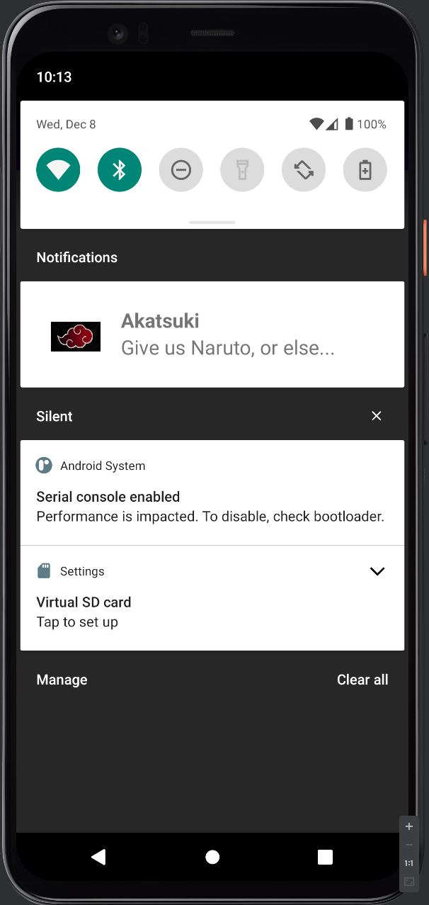
  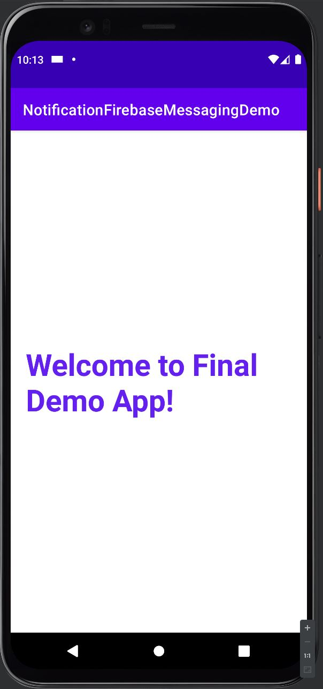
</p>

<p align="center">
  Figure 1. Final product. Notification box on the left, and notification layout on the right.
</p>

## Getting Started

We will be using Android Studio. To download it, go to this link: "https://developer.android.com/studio"

**Step 1:** Open Android Studio. Create a new project by clicking on New Project. Then select *Empty Activity.*

<p align="center">
  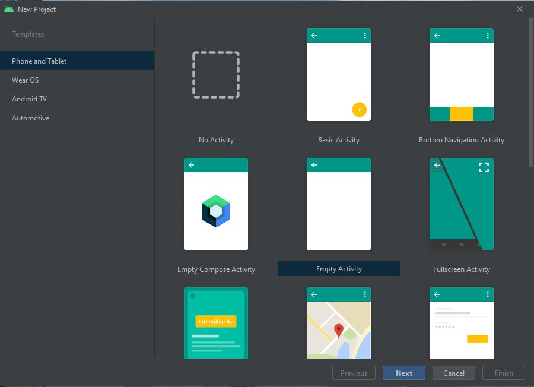
</p>
<p align="center">
  Figure 2. Select Empty Activity
</p>

**Step 2:** Give it a name, which in this case I chose *NotificationFirebaseMessagingDemo*. A desired Package name. Choose Language Kotlin, and a Minimum SDK of API 28: Android 9.0 (Pie), and press Finish.

**Step 3:** Connect our app to Firebase. Simply go to "https://console.firebase.google.com" with your google account and create a new project. Follow the steps until you get a message saying: *“Your new project is ready”*, and press the Continue button.

**Step 4:** Once your project is created click on the Android logo near the middle level of “Project Overview” page.

**Step 5:** Now, let’s give it a desired package name. I chose “CIS357FinalProject”. You can leave empty the fields of App nickname (optional), and Debug signing certificate SHA-1 (optional). Make sure it matches the package identifier in your project’s manifest.xml. Click on Register app button.

**Step 6:** Download the google-services.json file to your gradle build directory (the app sub-directory.) as shown in figure 3. Then, click on Next button.

<p align="center">
  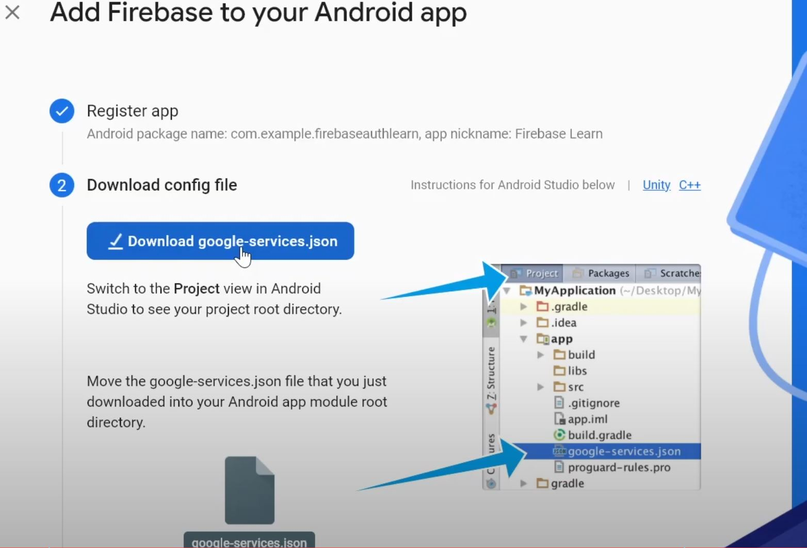
</p>
<p align="center">
  Figure 3. Download the JSON file.
</p>

**Step 7:** Add the following to your Project-level **build.gradle.**
```kotlin
<p>classpath <span style="color:green"> 'com.google.gms:google-services:4.3.10'</span>.</p>
```

**Step 8:** Add the following at the bottom of your App-level build.graddle.
```kotlin
<p>apply <span style="color:green"> plugin: 'com.android.application'</span>.</p>
<p>apply <span style="color:green"> plugin: 'com.google.gms.google-services'</span>.</p>
```
 
**Step 9:** Add the following inside of the dependencies block of your App-level build.graddle.
```kotlin
<p>implementation <span style="color:green"> 'com.google.firebase:firebase-messaging-ktx'</span>.</p>
<p>implementation <span style="color:green">'com.google.firebase:firebase-messaging-ktx:23.0.0'</span>.</p>
<p>implementation <span style="color:green">'com.google.firebase:firebase-analytics-ktx'</span>.</p>
```

**Step 10:** Finally, press “Sync now” at the top right corner in the bar that appears in the IDE. Then, press the Next and Continue to console buttons. Now we are ready to start coding.
  
## Step-by-step Coding Instructions
 
Let’s begin by modifying the layout file.

**Step 11:** Open activity_main.xml, which can be found within the layout folder. Let’s customize the default Text View with the following values:

```kotlin
<TextView
    android:layout_width="wrap_content"
    android:layout_height="wrap_content"
    android:text="Welcome to Final Demo App!"
    android:textSize="40dp"
    android:padding="20dp"
    android:textColor="#6320EE"
    android:textStyle="bold"
    app:layout_constraintBottom_toBottomOf="parent"
    app:layout_constraintLeft_toLeftOf="parent"
    app:layout_constraintRight_toRightOf="parent"
    app:layout_constraintTop_toTopOf="parent" />
```

Of course, customize it with your desired text and textColor. You will obtain this:
<p align="center">
  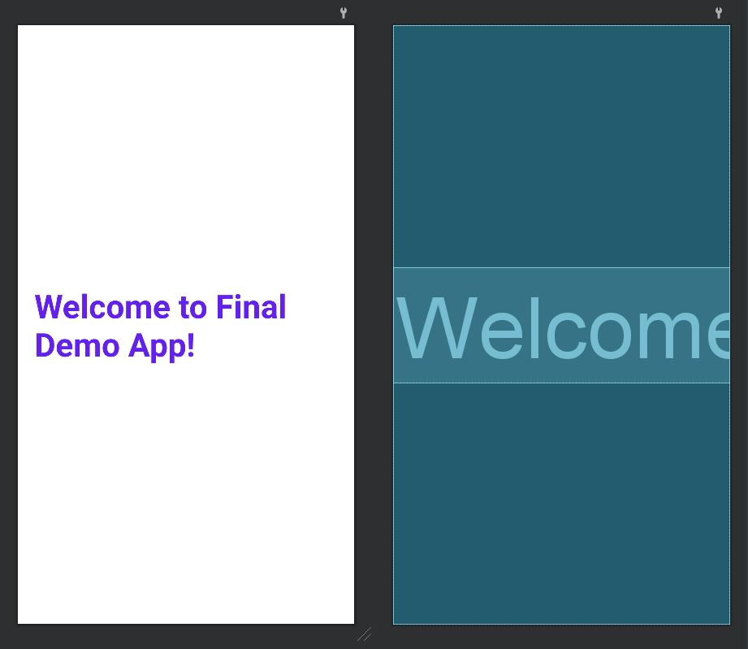
</p>
<p align="center">
  Figure 4. Layout of activity_main.xml.
</p>

Now, in order to use FCM, we need to do some changes in the manifest file.

**Step 12:** Open AndroidManifest.xml, which can be found under the manifests folder, and paste the following code inside the application block, but outside of the activity block:

```kotlin
<service
    android:name=".MyFirebaseMessagingService"
    android:exported="false"
    tools:ignore="Instantiatable">
    <intent-filter>
        <action android:name="com.google.firebase.MESSAGING_EVENT" />
    </intent-filter>
</service>

```

Upon pasting the above code, you will see an error because we have yet to create a class called MyFirebaseMessagingService.

**Step 13:**  Let’s create it by selecting your package name folder, right click and go to New>Kotlin Class/File. Name it MyFirebaseMessagingService, and double click on Class.

**Step 14:** Next, add the following code in your AndroidManifest.xml within the application block, and before the activity block:

```kotlin
<meta-data
    android:name="com.google.firebase.messaging.default_notification_icon"
    android:resource="@drawable/image_name" />
<meta-data
    android:name="com.google.firebase.messaging.default_notification_color"
    android:resource="@color/colorAccent" />
```

You will notice 2 errors. We need to add an image to use as the notification logo, and choose a color.

**Step 15:** To do this, you need to have a desired image file in your computer. Copy it, and paste it under res/drawable folder in Android Studio. Then replace the above image_name with the name of the image that we recently added to the drawable folder.

**Step 16:** Then, choose a desired color to replace colorAccent. I chose the default color purple_700.

We are now ready to work with the notification.

**Step 17:** Open MyFirebaseMessagingService.kt and extend it like this:

```kotlin
class MyFirebaseMessagingService : FirebaseMessagingService() {
}
```

**Step 18:** Create the custom layout for the notification. Go to res/layout and right click on layout folder. Go to New>Layout Resource File and name it notification. Press the OK button.

**Step 19:** In the notification.xml file, go to Code (on the top right corner), and replace all the code with the following:
```kotlin
<?xml version="1.0" encoding="utf-8"?>
<RelativeLayout xmlns:android="http://schemas.android.com/apk/res/android"
    android:layout_width="match_parent"
    android:layout_height="wrap_content">

</RelativeLayout>
```

**Step 20:** Add another RelativeLayout within the existing RelativeLayout with the following code:
```kotlin
<RelativeLayout
android:layout_width="wrap_content"
android:padding="10dp"
android:layout_height="match_parent">

</RelativeLayout>
```

**Step 21:** Next, we will add the logo for our app. Add the following code within the second RelativeLayout:
```kotlin
<ImageView
    android:id="@+id/app_logo"
    android:layout_width="70dp"
    android:layout_height="70dp"
    android:layout_marginLeft="10dp"
    android:layout_marginTop="10dp"
    android:padding="10dp"
    android:src="@drawable/akatzuki1" />
```

**Step 22:** Let’s add the title and the message. Add the following code after ImageView within the second RelativeLayout:
```kotlin
<TextView
    android:id="@+id/title"
    android:layout_width="wrap_content"
    android:layout_height="wrap_content"
    android:layout_marginLeft="10dp"
    android:layout_marginTop="15dp"
    android:layout_toRightOf="@+id/app_logo"
    android:text="Title"
    android:textSize="20sp"
    android:textStyle="bold" />

<TextView
    android:id="@+id/message"
    android:layout_width="wrap_content"
    android:layout_height="wrap_content"
    android:layout_below="@+id/title"
    android:layout_marginLeft="10dp"
    android:layout_toRightOf="@+id/app_logo"
    android:text="This is the message"
    android:textSize="20sp" />
```

Your notification will look similar to this:

<p align="center">
    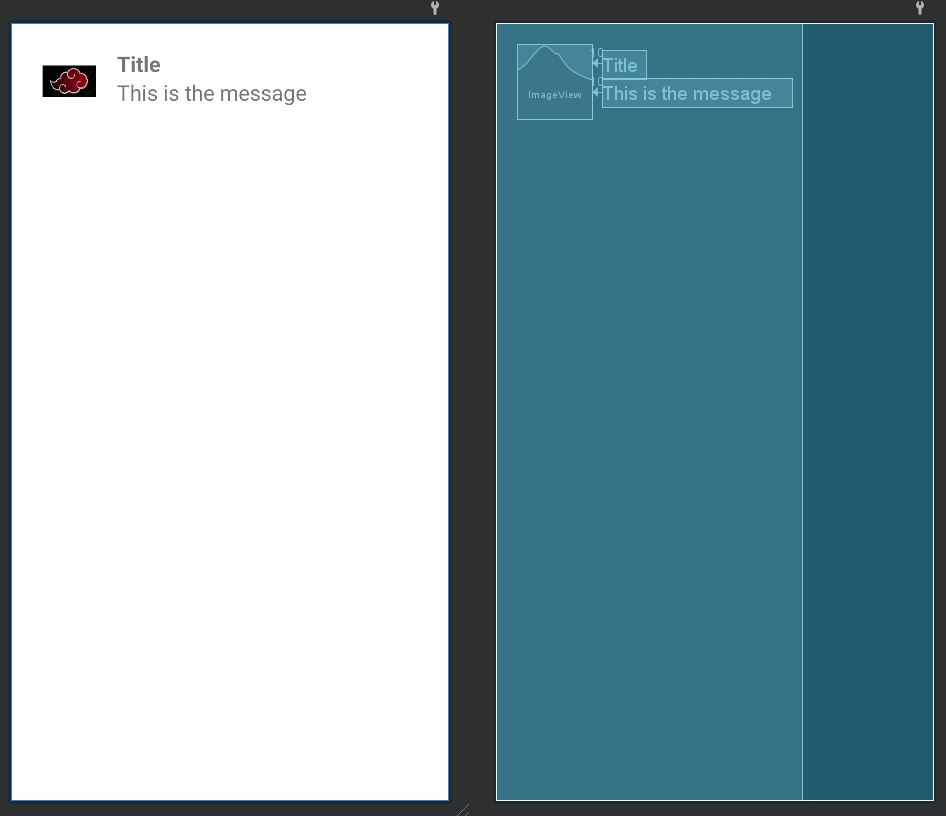
</p>
<p align="center">
  Figure 5. Layout of notification.xml.
</p>

Every notification needs to respond with an intent after a tap. To do this, we will use PendingIntent and setContentIntent() 

**Step 23:** Go to MyFirebaseMessagingService.kt and create a generateNotification function with the following parameters:

```kotlin
fun generateNotification(title: String, message: String) {
}
```

Now, let’s create an intent for the user notification.

**Step 24:** Add the following code within the function we recently created:
```kotlin
val intent = Intent(this, MainActivity::class.java)
intent.addFlags(Intent.FLAG_ACTIVITY_CLEAR_TOP)

val pendingIntent = PendingIntent.getActivity(this,0,intent, PendingIntent.FLAG_ONE_SHOT)
```

On line 1, intent will jump from this to the MainActivity. Line 2 will add a flag that will clear all activities on the activity stack, and it will put this activity at the top. Line 4 will let us use a coming intent in the future, and FLAG_ONE_SHOT indicates to use this activity only once after user taps on the notification, and the activity gets destroyed.

Next, we need to create the channel id, and channel name.

**Step 25:** Create the constant values before the beginning of class MyFirebaseMessagingService. Give it a name, and your package name.
```kotlin
const val channelId = "notification_channel"
const val channelName = "edu.gvsu.cis.notificationfirebasemessagingdemo"
```

Do not forget to change the channelName with the name of your package.

**Step 26:** Use NotificationCompat.Builder object to set the notification’s content and channel by adding the following in the generateNotification function:
```kotlin
var builder: NotificationCompat.Builder = NotificationCompat.Builder(applicationContext, channelId)
    .setSmallIcon(R.drawable.image_name)
    .setAutoCancel(true)
    .setVibrate(longArrayOf(1000,1000,1000,1000))
    .setOnlyAlertOnce(true)
    .setContentIntent(pendingIntent)
```

Change image_name with the name of the image that we added earlier. setAutoCancel automatically removes the notification when the user taps it. setVibrate will set the device vibration, which in this case the device will vibrate for 1 second, relax for 1 second, vibrate again for 1 second, and finally relax for 1 second. setOnlyAlertOnce will alert the notification only once. setContentIntent will pass the pending activity created above.

Now, we need to attach it with the notification’s layout that we previously built (Figure 5).

**Step 27:** Add the following after the above code:
```kotlin
builder = builder.setContent(getRemoteView(title,message))
```

You will see an error because we have yet to create the getRemoteView function.

**Step 28:** Create the getRemoteView as the following:
```kotlin
@SuppressLint("RemoteViewLayout")
fun getRemoteView(title: String, message: String): RemoteViews {
    val remoteView = RemoteViews("edu.gvsu.cis.notificationfirebasemessagingdemo", R.layout.notification)
    remoteView.setTextViewText(R.id.title,title)
    remoteView.setTextViewText(R.id.message,message)
    remoteView.setImageViewResource(R.id.app_logo,R.drawable.akatzuki1)

    return remoteView
}
```

This will map the layout to the title and message of the notification, and will return the remote view.

Afterwards, we need to create the notification manager.

**Step 29:** Add the following line of code within the generateNotification function:
```kotlin
val notificationManager = getSystemService(Context.NOTIFICATION_SERVICE) as NotificationManager
```

**Step 30:** Check if the client’s Android version is greater than or equal to Android Pie and show the notification within generateNotification function with the following:
```kotlin
if(Build.VERSION.SDK_INT >= Build.VERSION_CODES.O) {
    val notificationChannel = NotificationChannel(channelId, channelName,  NotificationManager.IMPORTANCE_HIGH)
    notificationManager.createNotificationChannel(notificationChannel)
}

notificationManager.notify(0,builder.build())
```

If true, it will create a notification channelId and a channelName with importance priority high. Then, it make the notification appear using the notificationManager.notify() object.

Thereafter, we will show the notification by creating a new function.

**Step 31:** Create another function called onMessageReceived with the following:
```kotlin
override fun onMessageReceived(remoteMessage: RemoteMessage) {
    if (remoteMessage.getNotification() != null) {
        generateNotification(remoteMessage.notification!!.title!!, remoteMessage.notification!!.body!!)
    }
}
```

This will receive the notification and call the respective functions. At this point, go ahead and run the app.

After successfully running the app, the only thing left to do is to send a notification from the Firebase console.

**Step 32:** Switch over to the Firebase project we previously created, and click on Cloud Messaging under Engage as shown in figure 6.
<p align="center">
  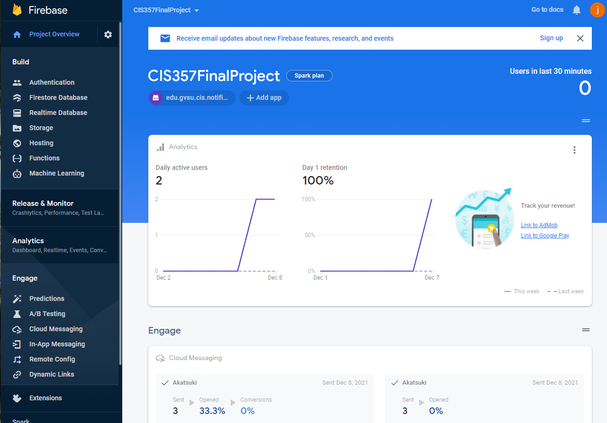
</p>
<p align="center">
  Figure 6. Firebase Console.
</p>

**Step 33:** Click on the Send your first message button and follow the instructions.
<p align="center">
  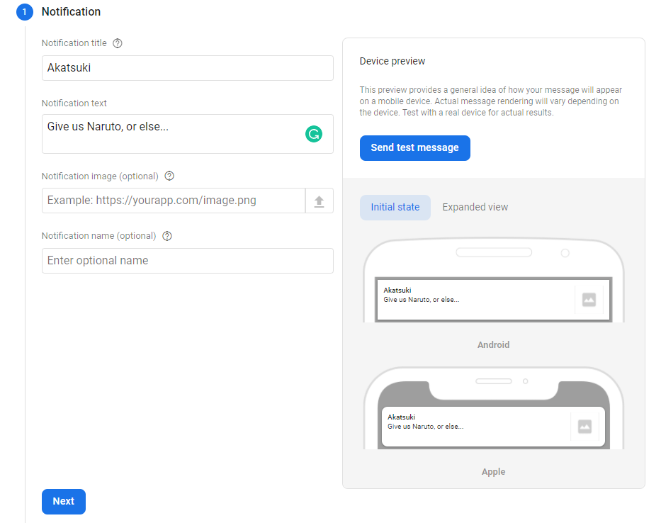
</p>
<p align="center">
  Figure 7. Compose notification - Notification.
</p>

You can skip the optional fields, and press the Next button.

**Step 34:** Select your package name as shown below and click on Next.
<p align="center">
  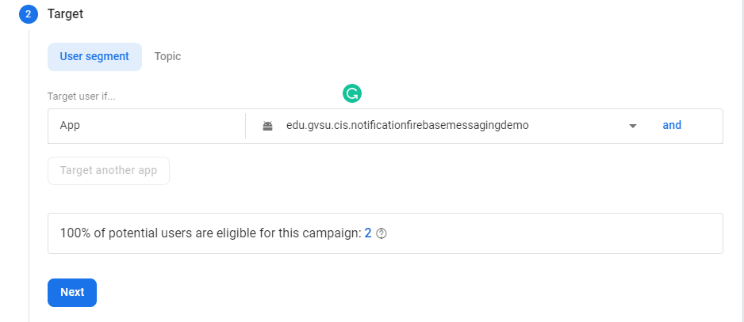
</p>
<p align="center">
  Figure 8. Compose notification - Target.
</p>

**Step 35:** Click on Next for Scheduling, and Conversion events. Then, press the Review button under Additional options.

**Step 36:** Click on the publish button as shown in figure 9, and switch over to your Android app.
<p align="center">
  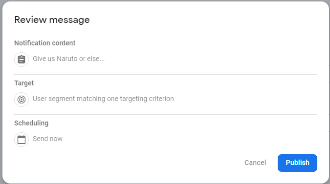
</p>
<p align="center">
  Figure 9. Compose notification – Review message.
</p>

Right after that, your app will receive the notification, and it will look similar to figure 10.
<p align="center">
  
</p>
<p align="center">
  Figure 10. A message from Akatsuki is shown as a new notification.
</p>

Since we are using a free tool as FCM, sometimes it might take a while for the notification to arrive. You can also track your sent message by clicking again on Cloud Messaging as shown in figure 11.
<p align="center">
  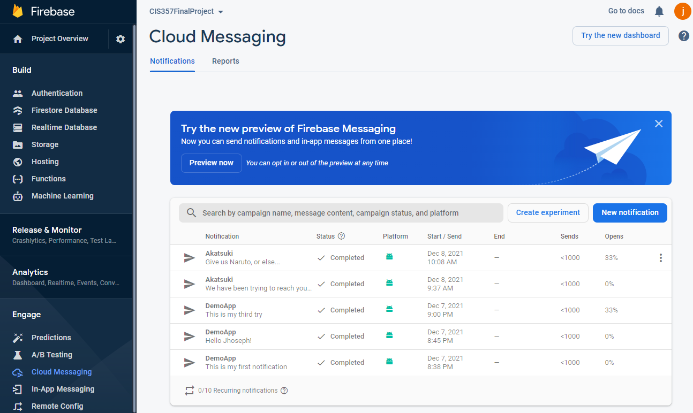
</p>
<p align="center">
  Figure 11. Cloud Messaging.
</p>

This tutorial is based on “Create a Notification” from "https://developer.android.com/training/notify-user/build-notification", “Set up an Android client” and “Send a test message” from "https://firebase.google.com/docs/cloud-messaging/android/client"

## Further Discussion/Conclusions

Finally, once you tap on the received notification, you will be directed to the home page of your app. Notice that before sending a message through Firebase, you need to have your app up and running. Otherwise, you will not receive a notification until the next time you run/open your app. Also, this tutorial was created with a targeting audience of Android 9.0 Pie or greater. 

Lastly, this is how we use Android Studio, and Firebase Cloud Messaging to create, send and receive notifications.
